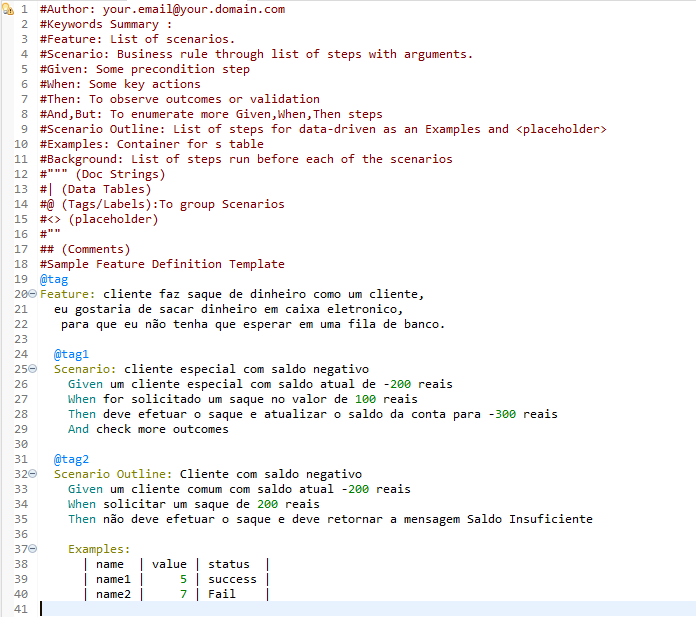
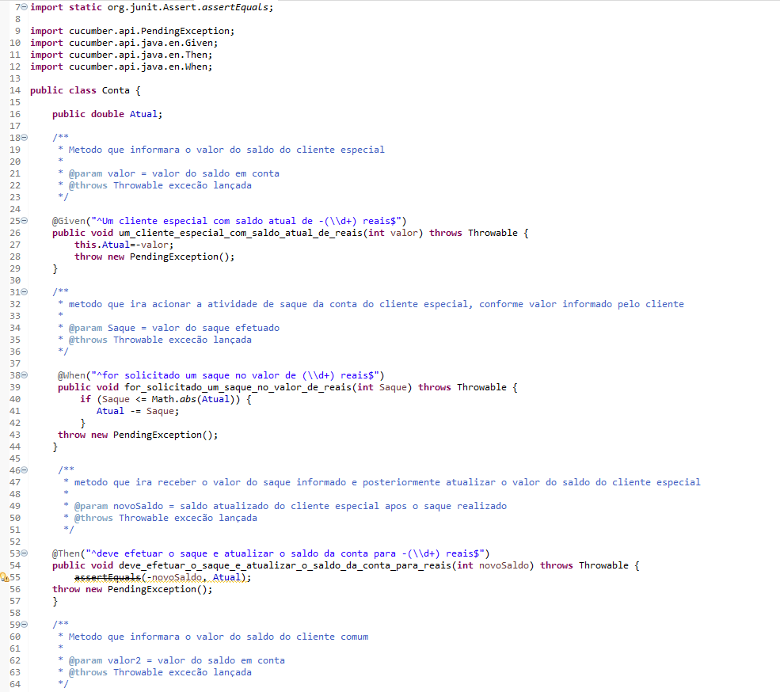
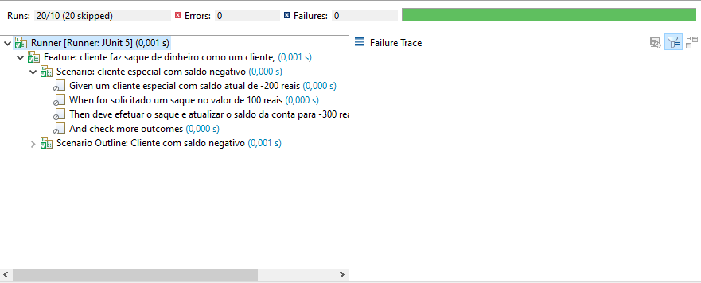

## BDD-ContaBancaria-AF
Este projeto foi desenvolvido para demonstrar o uso do Behavior Driven Development (BDD) na implementação de funcionalidades de uma Conta Bancária utilizando a linguagem de programação Java.

O Desenvolvimento Orientado a Comportamento (BDD) é uma abordagem que se concentra na descrição do comportamento esperado do sistema por meio de exemplos concretos. Utilizando ferramentas como Cucumber 

# Tecnologias Utilizadas
- Java: Linguagem de programação utilizada para implementação das funcionalidades.
- Cucumber: Framework de BDD utilizado para escrever cenários de teste em linguagem natural.
- JUnit: Framework de testes para validar o comportamento das funcionalidades implementadas.

# Cenario no Cucumber 
No arquivo chamado "testes.feature", utilizando o cucumber foram criados os cenarios que serão parametros para o projeto.

# Classe Conta Bancaria 
Nessa classe foram desenvolvidos os metodos que seram base para o funcionamento da conta bancaria e suas atividades
além disso ela esta integrada com o framework cucumber utilizando-se de suas funcionalidades para fazer os testes que nela são necessarios. 
 

# Testes Junit 
Apresentação dos testes que foram realizados dentro do projeto da conta bancaria utilizando BDD, Cucumber e Junit

